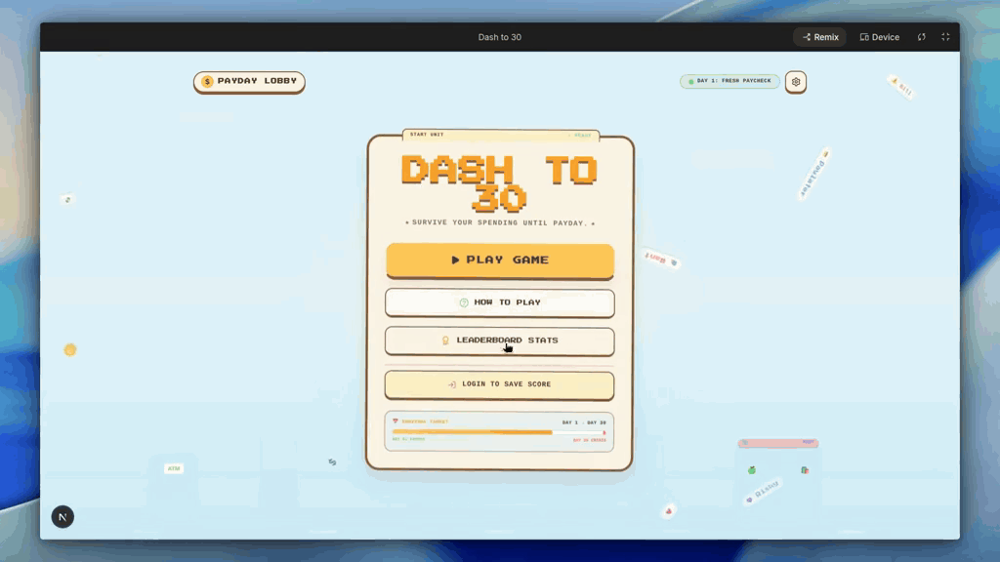

<div align="center">

</div>

# Dash to 30

**Survive your spending until payday.**

## Overview

Dash to 30 is a side-scrolling financial runner game. You play as a character who must survive from Day 1 to Day 30 while managing a balance and a Needs Life meter.

Before you play, you write a financial confession or choose a sample spending profile. Gemini uses this to create AI-personalized wants, needs, boss names, and roast messages. The game engine — built with Phaser — controls obstacle spawning, lanes, movement, difficulty, and collision. The result is a game where the financial challenges feel personal to you.

## Demo

[Watch the Submission Video](https://www.linkedin.com/posts/basuki-ridho_juaravibecoding-ugcPost-7466892921129340928-73dm/) · [Open in Google AI Studio](https://aistudio.google.com/apps/ce734090-b07e-42b4-8ba0-05ebac96662d?showPreview=true&showAssistant=true)

<p align="center">
   <a href="https://www.tiktok.com/@ridhsuki/video/7646124347857325319" target="_blank">
    
  </a>
</p>

> **Note:** The Google AI Studio link is a remixable app preview, not a public production deployment. If it shows a "Failed to load app" message, you may need to copy or remix it into your own Google AI Studio workspace. A remixed version will require your own Gemini API key and Firebase configuration.

## Deployment and Access

Google Cloud Run was the intended production deployment platform for this project. The deployment was not completed because the available trial-credit claim could not be used at the time. As an alternative, the app is shared as a Google AI Studio preview. Users who want to run it will need to configure their own Gemini and Firebase environment variables — see [Run Locally](#run-locally) for details.

## Core Features

- Day 1 to Day 30 survival gameplay with increasing difficulty
- AI-personalized financial challenges — Gemini generates want names, need names, boss labels, and roast messages based on your confession
- Crisis stages starting from Day 20, with a final boss phase near Day 28
- Balance and Needs Life management — both must stay above zero
- Guest mode (no sign-in required) and Google Sign-In
- Personal-best score saved locally
- Firebase global leaderboard for signed-in players
- Pause and restart controls during gameplay

## How It Works

1. Open the game and choose to play as a guest or sign in with Google.
2. Write your financial confession or select a sample spending profile.
3. Gemini generates your personalized wants, needs, boss names, and roast messages.
4. The game starts. Collect the starting payday to open your balance.
5. Jump to collect floating needs. Avoid wants and large financial bills.
6. Missing needs costs you Needs Life. Hitting wants drains your balance.
7. Difficulty increases as the days pass. Boss stages begin around Day 20.
8. Survive until Day 30 to win.
9. After the game ends, you receive a final score, personal-best result, and a personalized AI roast.
10. Signed-in players can submit their score to the global leaderboard.

**Score is calculated from:** days survived, needs collected, wants avoided, boss obstacles avoided, and remaining balance.

## Tech Stack

Next.js 15 · React 19 · TypeScript · Phaser 4 · Google GenAI SDK (`@google/genai`) · Firebase Authentication · Cloud Firestore · Tailwind CSS 4

## Run Locally

**Prerequisites:** Node.js

```bash
git clone https://github.com/Ridhsuki/dash-to-30.git
cd dash-to-30
npm install
```

Copy `.env.example` to `.env.local` and fill in your credentials:

```env
GEMINI_API_KEY=your_gemini_api_key
APP_URL=http://localhost:3000
NEXT_PUBLIC_FIREBASE_API_KEY=your_firebase_api_key
NEXT_PUBLIC_FIREBASE_AUTH_DOMAIN=your_project.firebaseapp.com
NEXT_PUBLIC_FIREBASE_PROJECT_ID=your_project_id
NEXT_PUBLIC_FIREBASE_STORAGE_BUCKET=your_project.appspot.com
NEXT_PUBLIC_FIREBASE_MESSAGING_SENDER_ID=your_sender_id
NEXT_PUBLIC_FIREBASE_APP_ID=your_app_id
NEXT_PUBLIC_USE_DEMO_LEADERBOARD=false
```

Then start the development server:

```bash
npm run dev
```

> **Security:** Never commit `.env.local`. Never publish real API keys or Firebase credentials. Use your own Firebase project and Gemini API key.

## Vibe Coding Journey

This project began in Google AI Studio as part of a vibe-coding workflow — writing ideas, prompting for code, and seeing the game take shape quickly. Development continued in Google Antigravity, where additional implementation, debugging, game-logic iteration, and feature refinement were completed. Both tools played a meaningful role in bringing the project together.

## Credits

- Initial development: [Google AI Studio](https://aistudio.google.com/)
- Further development and iteration: [Google Antigravity](https://deepmind.google/technologies/antigravity/)
- Selected sound effects: [MyInstants](https://www.myinstants.com/) — audio rights remain with their respective original owners

## Submission and Acknowledgment

This project was created for **[Juara Vibe Coding — May 2026](https://rsvp.withgoogle.com/events/juaravibecoding/home)**.

- [Watch the Project Submission](https://www.linkedin.com/posts/basuki-ridho_juaravibecoding-ugcPost-7466892921129340928-73dm/)
- [View Certificate of Participation](https://www.linkedin.com/posts/basuki-ridho_certificatejuaravibecoding2026pdf-ugcPost-7480188075080306688-Csqp/)

`#JuaraVibeCoding`